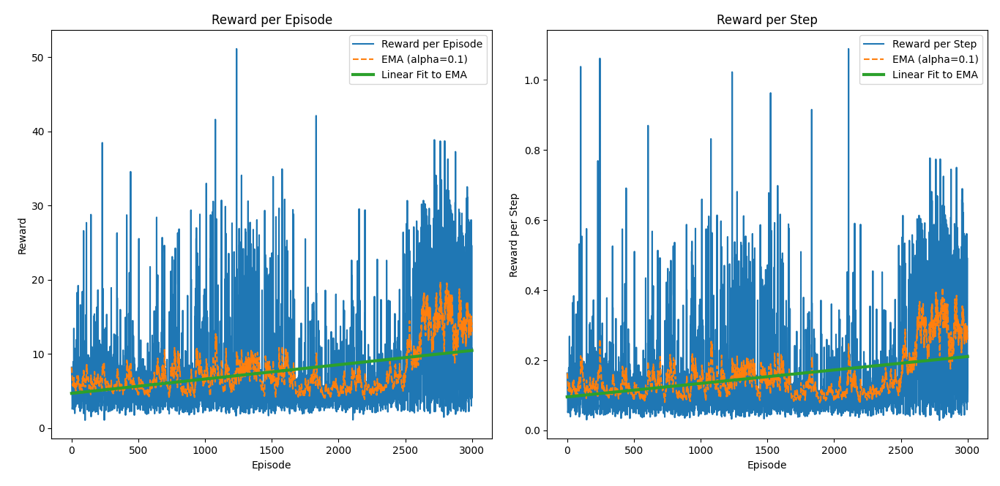

# **Ömer Coşkun | 2024700024**

## **Overview**

The implementation does not explicitly include `train()` and `test()` methods. Instead, the following commands are used for training and evaluation:

- **Training:**
  ```bash
  python homework2.py
  ```
- **Testing (fully greedy policy):**
  ```bash
  python evaluate.py
  ```

To regenerate the plots of the results, execute:
  ```bash
  python plot.py
  ```

---

## **Results**

During the initial phases of training, multiple models with varying hyperparameter sets were tested. Due to **time constraints**, training was limited to **3000 episodes**, although further training could potentially yield better results. The best performance was achieved with the model trained for **3000 episodes**, as detailed below:

### **Model Architecture**
- **Neural Network:** 2 hidden layers with dimensions **6 × 128 × 64 × 8**
- **Dropout Layers:** 2 dropout layers with a **40% dropout probability**

### **Hyperparameters**
```text
BUFFER_SIZE = 10,000
BATCH_SIZE = 32
GAMMA = 0.99
EPSILON_START = 1.0
EPSILON_END = 0.1
EPSILON_DECAY = 1000
LEARNING_RATE = 0.001
TARGET_UPDATE = 100
NUM_EPISODES = 3000
TAU = 0.005
STEPS PER EPISODE = 50
```

### **Target Network Update Strategy**
The best results were obtained using a **soft update** mechanism instead of a lagged update. The target network's weights are updated as follows:

```text
θ' ← τθ + (1 - τ)θ'
```

where `θ` represents the online network and `θ'` represents the target network.

### **Reward Modification**
Instead of directly using the reward provided by the environment, an alternative approach was implemented to accelerate the learning process. The reward pushed into replay memory is calculated as:

```text
new_reward - old_reward
```

Additionally, to further encourage the model to avoid negative actions, a penalty mechanism was introduced where **negative rewards were amplified by a factor of 3**.

---

## **Performance Analysis**

The model's performance fluctuates significantly during training. To better illustrate its progress, an **exponentially decaying moving average** of the rewards was plotted alongside a **linear regression fit**. The graph reveals a significant improvement in performance after **2500 episodes**, suggesting that extended training could yield even better results.

When evaluated in a **fully greedy mode**, the trained model achieves:
- **15–20 reward per episode** (in a 50 steps per episode setting)
- **0.3–0.4 reward per step per episode**

### **Training Performance Graph**


For comparison, an earlier version of the model trained for **1000 episodes** generates around **0.15 rewards per step per episode**. The corresponding results can be found in the `1000_episodes` directory.
